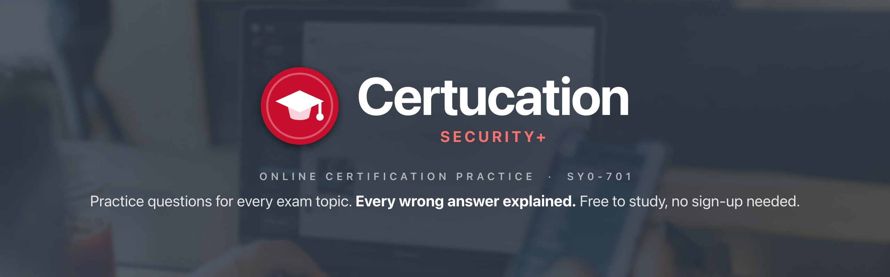
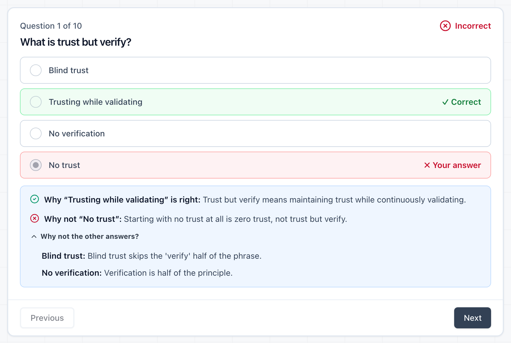
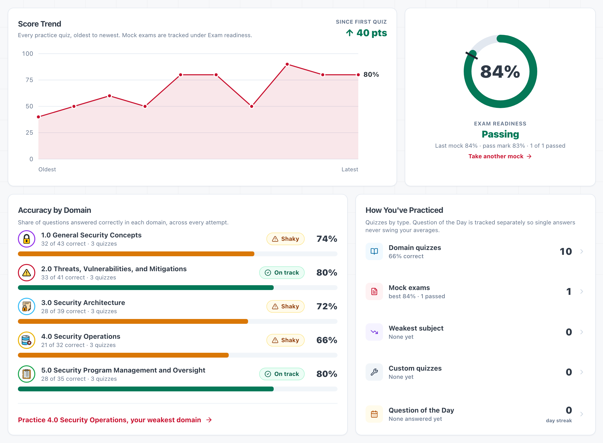
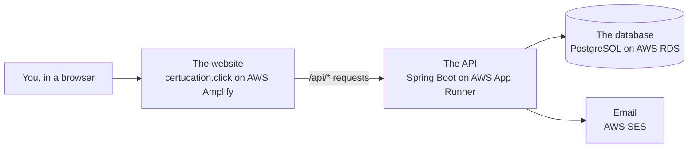

<p align="center">
  <a href="https://certucation.click">
    
  </a>
</p>

<p align="center">
  <a href="https://certucation.click"></a>
  
  
  
  
  
  
  
  
  
</p>

<p align="center">
  
</p>

**Certucation is a free website for studying for the CompTIA Security+ exam. Practise one exam
topic at a time or sit a timed 90-question mock exam, and after every answer see why the right
answer is right, and why each wrong one is wrong.**

> **What's live:** all of it, at [certucation.click](https://certucation.click). Studying needs
> no account. An account saves your results and keeps them in step across your devices.
> Resumable mock exams and drag-and-drop style questions are not built yet —
> [see the roadmap](#roadmap).

---

## The problem

Security+ (exam code **SY0-701**) is an entry-level IT security certification from CompTIA. The
exam is up to **90 questions in 90 minutes**, scored from 100 to 900, and **750 passes**. Many
questions describe a situation and ask for the *best* answer among several that sound right.

Most practice tools mark you and move on: right or wrong, and at most a line about the correct
answer. That is enough to remember one question. It is not enough to pass, because the real exam
asks the same idea in different words. What carries over to a question you have never seen is
knowing **why each wrong option is wrong**.

Certucation is built around that.

---

## What a question looks like

Every question in the bank is stored like this:

```json
{
  "question": "What does the CIA triad stand for in information security?",
  "choices": [
    "Confidentiality, Integrity, Availability",
    "Computer, Internet, Application",
    "Control, Identification, Authentication",
    "Cryptography, Identity, Access"
  ],
  "correctAnswer": 0,
  "explanation": "The CIA triad represents the three main pillars of information security: ...",
  "objective": "1.2",
  "difficulty": "Beginner"
}
```

Next to it sits a written reason for **every wrong choice**:

```json
{
  "Computer, Internet, Application":
    "Those are parts of an IT environment, not security goals. The triad names what security protects.",
  "Control, Identification, Authentication":
    "These are access-control ideas that help achieve security, but they aren't the three goals ...",
  "Cryptography, Identity, Access":
    "Cryptography and identity are tools for reaching security goals. The triad lists the goals themselves."
}
```

Pick "Cryptography, Identity, Access" and the quiz shows you, in one place:

> ✅ **Why "Confidentiality, Integrity, Availability" is right:** The CIA triad represents the
> three main pillars of information security: Confidentiality (keeping data private), Integrity
> (ensuring data accuracy), and Availability (ensuring access when needed).<br>
> ❌ **Why not "Cryptography, Identity, Access":** Cryptography and identity are tools for
> reaching security goals. The triad lists the goals themselves.<br>
> **Why not the other answers?** One line each, a tap away.

That is **444 questions and 1,332 wrong-answer explanations**. Every wrong choice in the bank has
one. Each question is also tagged with the exact exam objective it tests (`1.2` above), and
`npm run objectives` checks every tag against the official list.

---

## What you can do

| Mode | What it is |
|---|---|
| **Domain quizzes** | From 10 questions up to a whole exam topic, optionally by difficulty. Each answer is marked the moment you pick it. |
| **Mock exam** | 90 questions, 90 minutes, all five topics. Like the real exam, nothing is marked until the end, then you get the full breakdown. |
| **Weakest Subject** | A quiz from the topic you have been missing most. |
| **Build Your Own** | Mix topics and difficulty, or draw only questions you haven't seen yet. |
| **Question of the Day** | One question, about a minute, with a streak. |
| **Progress dashboard** | Your score trend, accuracy per topic, how close your last mock was to the pass mark, and the questions you keep missing. |

<p align="center">
  
  <br>
  <sub><i>The progress dashboard, from a demo account.</i></sub>
</p>

**Studying is free and never needs an account.** All 444 questions, the domain quizzes and the
mock exam work signed out, and always will. A quiz taken signed out is marked and explained in
full; it just isn't kept. **Keeping your results is what an account is for:**

| | Signed out | Account |
|---|---|---|
| Domain quizzes, mock exam | ✅ | ✅ |
| Answers marked, score and explanations shown | ✅ | ✅ |
| Results kept after you close the page | — | ✅ |
| Progress dashboard | — | ✅ |
| Weakest Subject, Build Your Own, Question of the Day and its streak | — | ✅ |
| Sync across devices | — | ✅ |
| Resume an interrupted mock exam | — | planned |

**There is no leaderboard and no comparison between users.** An account keeps your own study
data safe. It never shows how you rank against anyone, and your results are never visible to
another user. The reasoning behind these choices is in [docs/decisions.md](docs/decisions.md).

---

## The exam, in five topics

CompTIA splits SY0-701 into five domains, each worth a fixed share of the exam. Here is how the
question bank lines up against them:

| Domain | Share of the exam | Questions here |
|---|---:|---:|
| 1.0 General Security Concepts | 12% | 104 |
| 2.0 Threats, Vulnerabilities, and Mitigations | 22% | 107 |
| 3.0 Security Architecture | 18% | 110 |
| 4.0 Security Operations | 28% | 36 |
| 5.0 Security Program Management and Oversight | 20% | 87 |
| **Total** | **100%** | **444** |

---

## Honest limits

What the app doesn't do yet, or doesn't do well:

- **The bank is lopsided.** Security Operations is the biggest part of the real exam, 28%, but
  has 36 of the 444 questions. That is the most important gap to close.
- **Some questions are filed under the wrong topic.** 147 of the 444 sit in a different domain
  from the objective they actually test, so per-topic stats describe the filing, not the
  content. `npm run objectives` lists them.
- **The mock exam isn't weighted.** It draws 90 questions at random, not in the exam's
  proportions.
- **Multiple choice only.** The real exam also has performance-based questions (drag-and-drop,
  simulations). None are here yet.
- **Six objectives are too thin to practise** (fewer than 5 questions each): 1.3, 2.1, 2.5, 4.2,
  4.9 and 5.3.
- **Emails only reach one address for now.** Until AWS grants the email service production
  access, confirmation and reset emails only reach the account owner's verified address.
- **Authenticator-app secrets are stored in plain text** in the database. The database itself
  is private and encrypted, but these should be encrypted with a key held outside it.
- **Six written lessons have no page.** Their content is in
  `secapp/src/components/data/lessonsData.js`, but no route shows them.

---

## How it works

Four pieces, all on AWS:



- **The website** is everything you see and click. Practice quizzes are marked right in your
  browser, so feedback is instant.
- **The API** is the part you never see. It checks your password, sends you the questions and
  saves your results.
- **The database** keeps the questions, the accounts and every quiz you've taken. It sits in a
  private network that only the API can reach.
- **Email** sends confirmation links, password resets and sign-in codes.

The website and the API share **one domain**. Amplify serves the pages and passes `/api/*`
through to the API. That matters: the sign-in cookie is `SameSite=Strict`, so an API on its own
domain would never receive it, and every session would end fifteen minutes after sign-in. The
whole AWS setup is written as code (Terraform, in [`infra/`](infra/README.md)). The full
walk-through, in plain English: [The big picture](docs/guide/big-picture.md).

### Built with

| Technology | In plain English | Its job here |
|---|---|---|
| **React 19** + React Router | A library for building web pages that update without reloading | Every screen, and moving between them |
| **Vite 7** | A build tool | Turns the source code into the small, fast files your browser downloads |
| **Tailwind CSS** + **shadcn/ui** | A styling system, and a set of ready-made components | The look: colours, spacing, buttons, cards |
| **Java 25** + **Spring Boot 4.1** | A programming language, and a framework for building web servers | The API: sign-in, questions, saving results |
| **Spring Security** | The security toolkit for Spring | Guards every request that needs you signed in |
| **PostgreSQL** | A database | Stores the questions, accounts and quiz history |
| **Flyway** | Numbered, one-way changes to the database | Upgrades the database structure safely, one step at a time |
| **AWS Amplify** | Website hosting | Builds and publishes the site on every push to `main` |
| **AWS App Runner** + **ECR** | Runs a server from a packaged image, and stores those images | Runs the API |
| **AWS RDS** | A managed database service | Runs PostgreSQL, backed up and private |
| **AWS SES** | Email sending | Confirmation, password-reset and sign-in-code emails |
| **Route 53** + **ACM** | Domain names, and HTTPS certificates | certucation.click and its padlock |
| **SSM Parameter Store** | A vault for secrets | Holds passwords and keys, so none live in the code |
| **Terraform** | Infrastructure written as code | Creates the entire AWS setup from files in `infra/` |
| **Docker** | Packages software so it runs the same anywhere | Builds the API image; runs the database on your machine |
| **GitHub Actions** | Automatic checks on every push | Lint, question-bank checks, builds and tests |
| **JUnit 5** + **Testcontainers** | Automated tests, run against a real, throwaway database | Proves sign-in, two-factor and data rules still hold |

### Security

An account holds your email address and your study history, so it is protected properly:

- **Passwords** are stored only as BCrypt hashes. Sign-in uses a 15-minute token plus a rotating
  30-day refresh token in an `httpOnly`, `SameSite=Strict` cookie. Reusing an old refresh token
  signs that account out everywhere.
- **Optional two-factor sign-in** by email code or authenticator app, with one-time recovery
  codes. Every authenticator code works once.
- **Email verification** gates password reset, and a reset ends every other session.
- **Rate limits** per account and globally, not just per IP, so guessing passwords or flooding
  someone's inbox doesn't work even from many addresses.
- **Every page** sends a Content Security Policy and anti-framing headers. **The database** sits
  in a private network only the API can reach.

Details: [docs/backend.md](docs/backend.md).

### Why Postgres *and* DynamoDB

Users, questions, attempts and per-question answers are deeply relational, and the whole
progress dashboard is built from totals over them. That is Postgres's job. The one thing that
isn't relational is an **in-progress exam session**: written on every answer, read only by its
own id, never joined to anything, and worthless once the exam is finished or abandoned. DynamoDB
stores it as a single item, and a TTL attribute expires the abandoned ones with no cleanup job
to write or run. DynamoDB is not in use yet. It arrives with resumable mock exams.

---

## Run it yourself

**New here, or back after a break?** Start with the plain-English guides in
[docs/guide/](docs/guide/README.md).

**You need:** Git, **Node 22+**, **JDK 25**, and **Docker Desktop** (running). Only Node is
needed for the website alone.

```bash
git clone https://github.com/NICOCODIGO/SECURITYPLUS-QUIZ.git
cd SECURITYPLUS-QUIZ
./scripts/doctor.sh      # checks your tools, installs packages, creates secapp/.env.local
```

**Run it** in two terminals:

```bash
cd server && ./gradlew bootRun    # the API on :8080, with its database in Docker
cd secapp && npm run dev          # the website on http://localhost:5173
```

The first `bootRun` takes a few minutes while Docker downloads the database. It stays at
`80% EXECUTING` while it runs; that is normal. Locally, emails are printed in the API's terminal
instead of sent, so that is where to find a sign-in code or a reset link.

**Check your work:**

```bash
./verify.sh          # everything: docs, question bank, lint, website build, API tests
./verify.sh --web    # the website only, no Docker needed
```

It prints PASS / FAIL / SKIP per check. Without Docker, the API tests show SKIPPED, not passed.

**On Windows:** run the scripts from **Git Bash**, not PowerShell. **On a Mac:** Terminal works
as-is. More in [Everyday tasks](docs/guide/everyday-tasks.md).

### Shipping

- **The website:** push to `main`. Amplify builds and publishes it in about three minutes, after
  running the lint and question-bank checks, so a failing build never replaces the live site.
- **The API and the AWS setup:** `./scripts/deploy.sh` (needs `aws configure` and Docker).
- **A change that needs both:** run `deploy.sh` first, then push.

### Repository layout

```
secapp/     the website (React, Vite, Tailwind)
server/     the API (Java 25, Spring Boot, PostgreSQL)
infra/      the AWS setup (Terraform)
scripts/    doctor.sh, deploy.sh, and doc/content checks
docs/       technical docs, and docs/guide/, the plain-English guides
verify.sh   every check, one command
```

Every file and folder, one line each: [docs/guide/files.md](docs/guide/files.md).

### Documentation

| | |
|---|---|
| [docs/guide/](docs/guide/README.md) | **Start here.** Plain-English guides: the big picture, where the data lives, every file explained, everyday tasks, a glossary. |
| [docs/decisions.md](docs/decisions.md) | What was built, and what was deliberately removed. Read it before adding "missing" features. |
| [docs/architecture.md](docs/architecture.md) | The roadmap and phases. |
| [docs/devops.md](docs/devops.md), [infra/README.md](infra/README.md) | Docker, CI, deploying, the domain and email. |
| [docs/backend.md](docs/backend.md), [docs/database.md](docs/database.md) | The API, sign-in, the schema. |
| [docs/frontend.md](docs/frontend.md), [docs/components.md](docs/components.md) | Pages, storage, styling. |
| [docs/content.md](docs/content.md) | The question bank. |

---

## Roadmap

- [x] Front end: quizzes, mock exam, custom builder, progress dashboard
- [x] Wrong-answer explanations for all 1,332 incorrect choices
- [x] Back end groundwork: schema, migrations, containers, CI
- [x] Question bank served from the database
- [x] Accounts: email + password, rotating refresh tokens, email verification, password reset,
      optional two-factor sign-in
- [x] Study history synced to your account, across devices
- [x] AWS deployment: live at certucation.click, website shipping on every push to `main`
- [x] Security review and hardening
- [ ] Resumable mock exams, drawn weighted to the real exam blueprint
- [ ] Question authoring UI, then performance-based questions (drag-and-drop, hotspot)

---

<p align="center">
  <a href="https://certucation.click">
    
  </a>
</p>

<p align="center">
  <sub><i>Certucation is an independent study project. It is not affiliated with, endorsed by, or
  connected to CompTIA. CompTIA and Security+ are trademarks of CompTIA, Inc. Banner photo from
  <a href="https://unsplash.com">Unsplash</a>.</i></sub>
</p>
